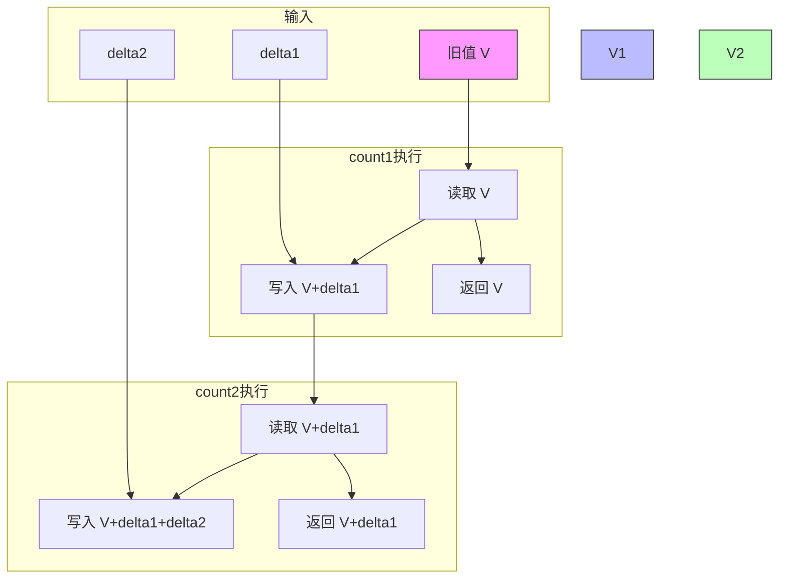

<!-- lec04 -->

# CReg - mkCReg(numeric type n, type t)

> mkCReg: `r < w`，多端口并发寄存器，同一周期内高端口可见低端口的写入，写仲裁时低端口优先

## 简单介绍

CReg，描述其功能就是并发寄存器，开几个读写接口，同一个时钟周期内，后面的可以看到前面的写入

> 本质：一个物理寄存器 + 写仲裁器（低端口优先，低的覆盖高的）+ 读转发（高端口可见低端口写入）

```bluespec
CReg#(7, int) ctr <- mkCReg(0);  // 初始为 0

ctr[1] <= 233; // 同一周期：ctr[0]读0，ctr[1]读0（同端口先读后写）
ctr[5] <= 666; // 同一周期：ctr[2]~ctr[6]都能读到233（高端口可见低端口写），读不到666

// 核心：读可见性（高端口见低端口写）≠ 写优先级（低端口覆盖高端口）
// 最终仲裁：port1(233) > port5(666) > port6(234)，生效的是233
ctr[6] <= ctr[6] + 1;  // ctr[6]读到233，想写234，但被port1覆盖

// 下一周期：所有端口读到233（不是667，因为低端口的写覆盖！）
// 如果是：ctr[0] <= ctr[6] + 1;  则下周期读到 667 ！
```

## 简单应用

```bluespec
module mkCounter2_CReg(Counter2IFC);
  // 2端口 CReg
  CReg#(2, int) ctr <- mkCReg(0);

  // count1 使用端口0
  method ActionValue#(int) count1(int delta);
    ctr.ports[0] <= ctr.ports[0] + delta;
    return ctr.ports[0];   // 返回旧值
  endmethod

  // count2 使用端口1
  method ActionValue#(int) count2(int delta);
    ctr.ports[1] <= ctr.ports[1] + delta;
    return ctr.ports[1];   // 返回旧值
  endmethod
endmodule
```

行为解析：



最后写入的是：`(V + delta1) + delta2`
