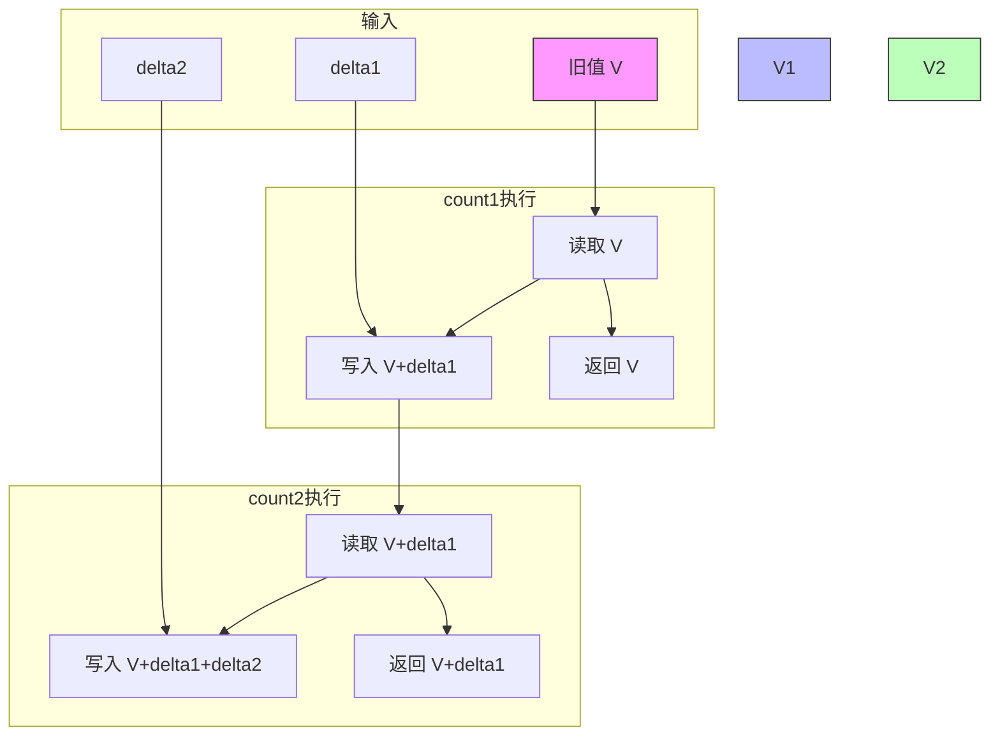

<!-- lec04 -->

# CReg - mkCReg(Integer n, t init) → Reg#(t)[]

> mkCReg: `r < w`，多端口并发寄存器（n≤5），同一周期内高端口可见低端口的写入，写仲裁时被写的最高编号端口胜出

## 简单介绍

CReg，描述其功能就是并发寄存器，开几个读写接口，同一个时钟周期内，后面的可以看到前面的写入

> 本质：一个物理寄存器 + 写仲裁器（被写的最高编号端口胜出）+ 读转发（高端口可见低端口写入），端口数 n≤5

```bluespec
Reg#(int) ctr[3] <- mkCReg(3, 0);  // 3端口（n≤5），初始为 0

ctr[0] <= 233; // 端口0写233；同端口先读后写，ctr[0]本周期仍读到旧值0
ctr[1] <= 666; // 端口1读到233（可见更低端口port0的写），再写666
ctr[2] <= ctr[2] + 1;  // 端口2读到666（见port0,1取最高编号者），写667

// 核心：读可见性（高端口见低端口写）≠ 写优先级（最高编号写端口覆盖低端口）
// 最终仲裁：被写的最高编号端口 port2 胜出，下一周期所有端口读到 667
```

## 简单应用

```bluespec
module mkCounter2_CReg(Counter2IFC);
  // 2端口 CReg
  Reg#(int) ctr[2] <- mkCReg(2, 0);

  // count1 使用端口0
  method ActionValue#(int) count1(int delta);
    ctr[0] <= ctr[0] + delta;
    return ctr[0];   // 返回旧值
  endmethod

  // count2 使用端口1
  method ActionValue#(int) count2(int delta);
    ctr[1] <= ctr[1] + delta;
    return ctr[1];   // 返回旧值
  endmethod
endmodule
```

行为解析：



最后写入的是：`(V + delta1) + delta2`
