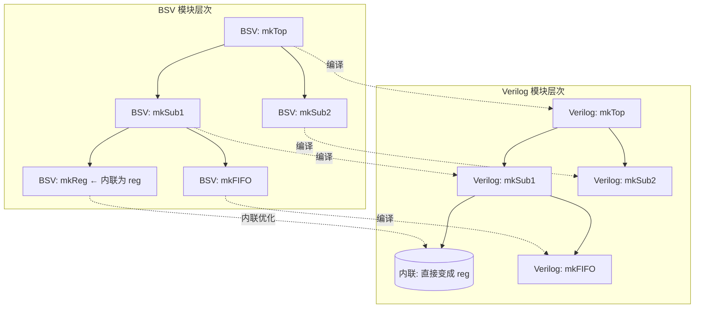

<!-- lec 09 -->

# 编译到 Verilog ...

## 核心映射总览

| BSV 概念 | Verilog 映射 | 说明 |
|:----------:|:-------------:|:------:|
| 模块 (`module`) | Verilog 模块 | 每个 BSV 模块生成一个 `.v` 文件 |
| 接口方法 | 端口组 | 参数 → input，返回值 → output |
| 方法条件 | `RDY_*` 信号 | 输出，表示方法是否可调用 |
| Action/ActionValue | `EN_*` 信号 | 输入，表示方法被调用 |
| 规则 (`rule`) | 条件 + 更新逻辑 | `CAN_FIRE` + `WILL_FIRE` + 状态更新 |
| 寄存器 (`mkReg`) | `reg` + 复位逻辑 | 同步复位，`RST_N` 低有效 |
| 子模块实例 | 子模块实例化 | 层次结构保留 |

## 方法到端口的映射

| 方法类型 | 参数 | 返回值 | 条件 | 使能 |
|:----------:|:------:|:--------:|:------:|:------:|
| `Value method` | input | output | `RDY` | 无 |
| `Action method` | input | 无 | `RDY` | `EN` |
| `ActionValue` | input | output | `RDY` | `EN` |

## 规则到逻辑的映射

```
rule r (cond);
  x <= x + 1;
  y <= x;      // 读的是旧值！
endrule

         ↓ 编译

CAN_FIRE   = cond && RDY_子方法...
WILL_FIRE  = CAN_FIRE && 无更高优先级规则冲突

always @(posedge CLK)
  if (WILL_FIRE) begin
    x <= x + 1;   // 新值
    y <= x;       // 旧值（x 更新前的值）
  end
```

## 重要属性

| 属性 | 作用 |
|:------:|:------:|
| `(* synthesize *)` | 标记模块可独立编译成 Verilog |
| `(* always_ready *)` | 方法永远就绪，不生成 `RDY` 信号 |
| `(* always_enabled *)` | 方法每周期调用，不生成 `EN` 信号 |
| `(* prefix = "" *)` | 控制端口名前缀 |
| `(* clocked_by = "clk" *)` | 指定时钟信号名 |

## 模块层次结构



- 默认情况下，子模块实例化为独立的 Verilog 子模块
- 使用 `(* synthesize *)` 控制内联行为

## 调试信号

| 信号 | 含义 |
|:------:|:------:|
| `CAN_FIRE_<rule>` | 规则条件满足，可以触发 |
| `WILL_FIRE_<rule>` | 规则实际会触发（考虑冲突后） |
| `RDY_<method>` | 方法可调用 |
| `EN_<method>` | 方法被调用 |

查看方式：
```bash
bsc -verilog -keep-fires -g myMod myMod.bsv
grep -E "(CAN_FIRE|WILL_FIRE)" myMod.v
```

## 编译选项速查

```bash
# 编译命令
bsc -verilog -g <module> <file>          # 生成 Verilog
bsc -verilog -vdir <dir> -g <module>     # 指定输出目录

# 调试选项
bsc -verilog -keep-fires                 # 保留 WILL_FIRE
bsc -verilog -keep-method-conditions     # 保留方法条件
bsc -verilog -no-opt                     # 禁用优化
```
