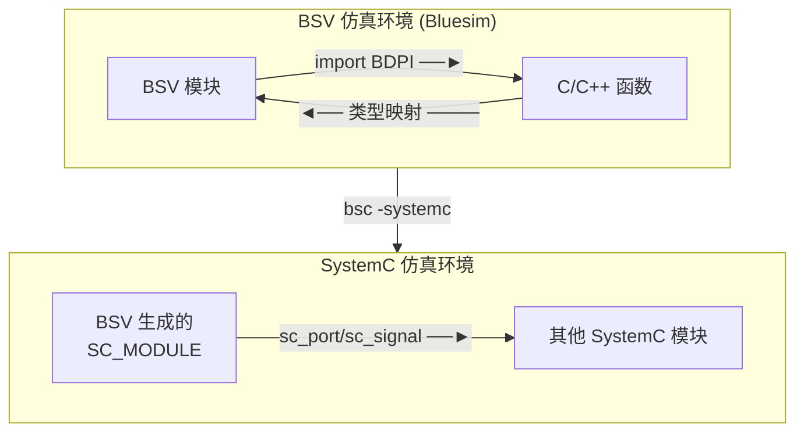

<!--
    <comment> lec 11 interop c / interfacing with c </comment>
--->

# 与 C 互操作

两个方向：



## BDPI 导入 C 函数

> Bluespec Direct Programming Interface, 除了部分不一致，其他和 Verilog DPI-C 差不多

| BSV 声明 | C 函数签名 | 说明 |
|:--------:|:------:|:------:|
| `function t f(args)` | `t f(args)` | 值函数，返回值直接返回 |
| `function Action a(args)` | `void a(args)` | Action，无返回值 |
| `function ActionValue#(t) av(args)` | `void av(t* result, args)` | ActionValue，第一个参数是输出指针 |

小于等于 64 位的参数映射：

| BSV 类型 | C 类型 | 头文件 |
|:----------:|:--------:|:--------:|
| `Bit#(n)` (n≤64) | `uint<n>_t` | `<stdint.h>` |
| `Int#(n)` (n≤64) | `int<n>_t` | `<stdint.h>` |
| `UInt#(n)` (n≤64) | `uint<n>_t` | `<stdint.h>` |
| `Bool` | `uint8_t` | `<stdint.h>` |

> 大于64位的，以及结构体类型：直接 `void*` 使用指针映射

示例：

```bluespec
// BSV
import "BDPI" function Bit#(32) add(Bit#(32) a, Bit#(32) b);

// C
uint32_t add(uint32_t a, uint32_t b) {
    return a + b;
}
```

示例对照表：

| BSV | C |
|:--:|:--:|
| `import "BDPI" function Action f(Bit#(32) x);` | `void f(uint32_t x);` |
| `import "BDPI" function ActionValue#(Bit#(32)) g();` | `void g(uint32_t* result);` |
| `import "BDPI" function Bit#(64) h(Bit#(32) a, Bool b);` | `uint64_t h(uint32_t a, uint8_t b);` |
| `import "BDPI" function ActionValue#(Bit#(128)) p(Bit#(128) d);` | `void p(void* result, const void* d);` |
| `import "BDPI" function Action q(MyStruct s);` | `void q(const void* s);` |
| `import "BDPI" function ActionValue#(MyStruct) r();` | `void r(void* result);` |
| `import "BDPI" function ActionValue#(Vector#(3, Bit#(32))) s();` | `void s(void* result);` |

其中，C 文件在源文件列表指定即可：

```shell
bsc -sim -g mkTest Test.bsv
bsc -sim -e mkTest -o test xxx.c yyy.c
./test
```

Cpp 函数与 C 差不多，只不过为了防止签名冲突，需要在函数名前添加 `extern "C"`

## SystemC 导入 BSV 模块

> BSV 模块可以导出为 SystemC SC_MODULE，供 SystemC 仿真环境使用
> > mkMyModule(BSV) -> mkMyModule.{h,cxx}(SC_MODULE声明) -> main.cpp(sim) -> g++ -lsystemc -> .o/.exe

```sh
bsc -systemc -g mkAdder Adder.bsv  # mkAdder.h mkAdder.cxx
```

示例：

```bluespec
// Adder.bsv
package Adder;

interface AdderIFC;
    method Action set(Bit#(8) a, Bit#(8) b);
    method Bit#(8) get_sum();
    method Bool ready();
endinterface

(* synthesize *)
module mkAdder(AdderIFC);
    Reg#(Bit#(8)) a_reg <- mkReg(0);
    Reg#(Bit#(8)) b_reg <- mkReg(0);
    Reg#(Bit#(8)) sum_reg <- mkReg(0);
    Reg#(Bool) valid <- mkReg(False);

    rule r_compute;
        sum_reg <= a_reg + b_reg;
        valid <= True;
    endrule

    method Action set(Bit#(8) a, Bit#(8) b);
        a_reg <= a;
        b_reg <= b;
        valid <= False;
    endmethod

    method Bit#(8) get_sum();
        return sum_reg;
    endmethod

    method Bool ready();
        return valid;
    endmethod
endmodule

endpackage
```

> ...详见：`execs/10-03-01-adder2sv`

**生成的文件**：

| 文件 | 用途 | 用户是否需要修改 |
|:----:|:------:|:------------------:|
| `mkAdder.h` | BSV 模型类声明 | ❌ 仅内部使用 |
| `mkAdder.cxx` | BSV 模型实现 | ❌ 仅内部使用 |
| `model_mkAdder.h/cxx` | Bluesim 模型封装 | ❌ 仅内部使用 |
| **`mkAdder_systemc.h`** | **SystemC 模块声明** | ✅ **用户需要包含** |
| **`mkAdder_systemc.cxx`** | **SystemC 包装器实现** | ⚠️ 链接时需要 |

关键点：

- 用户只需要关心 `mkAdder_systemc.h`
- 其他文件是 BSV 行为模型的实现，不直接使用

| BSV | SystemC 端口名 | 方向 | 说明 |
|:-----:|:--------:|:------:|:-----:|
| `module mkAdder` | `mkAdder` | - | SC_MODULE 名称 |
| 隐含 | `CLK` | 输入 | 时钟 |
| 隐含 | `RST_N` | 输入 | 复位（低有效） |
| `method Action set` | `EN_set` | 输入 | 使能信号 |
| `method Action set` 参数 `a` | `set_a` | 输入 | 第一个参数 |
| `method Action set` 参数 `b` | `set_b` | 输入 | 第二个参数 |
| `method Action set` | `RDY_set` | 输出 | 就绪信号 |
| `method Bit#(8) get_sum` | `get_sum` | 输出 | 返回值 |
| `method Bit#(8) get_sum` | `RDY_get_sum` | 输出 | 就绪信号 |
| `method Bool ready` | `ready` | 输出 | 返回值 |
| `method Bool ready` | `RDY_ready` | 输出 | 就绪信号 |
