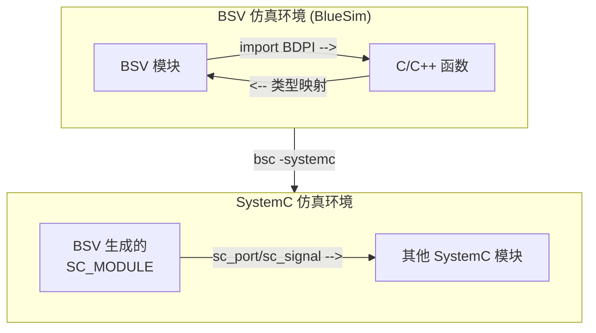

<!--
    <comment> lec 11 interop c / interfacing with c </comment>
--->

# 与 C 互操作

两个方向：



> BDPI 不限于 Bluesim：Verilog 后端经 VPI/DPI 调用同一份 C 实现。

## BDPI 导入 C 函数

> Bluespec Direct Programming Interface, 除了部分不一致，其他和 Verilog DPI-C 差不多

| BSV 声明 | C 函数签名 | 说明 |
|:--------:|:------:|:------:|
| `function t f(args)` | `t f(args)` | 值函数，返回值直接返回 |
| `function Action a(args)` | `void a(args)` | Action，无返回值 |
| `function ActionValue#(t) av(args)` | 窄返回 `t av(args)` 直接 return；≥65位/结构体才 `void av(t* result, args)` | ActionValue |

参数/返回按位宽映射到【原生 C 类型】（非 `<stdint.h>` 定宽类型）：

| BSV 类型 | C 类型 |
|:----------:|:--------:|
| `Bit#(0)`~`Bit#(8)`（含 `Bool`） | `unsigned char` |
| `Bit#(9)`~`Bit#(32)` | `unsigned int` |
| `Bit#(33)`~`Bit#(64)` | `unsigned long long` |
| `Bit#(65)+` / 多态 `Bit#(n)` / 结构体 | `unsigned int*`（指向32位字数组） |
| `String` | `char*` |

> `Int#(n)`/`UInt#(n)` 同位宽桶映射（有符号语义由 C 侧自理）

示例：

```bluespec
// BSV
import "BDPI" function Bit#(32) add(Bit#(32) a, Bit#(32) b);

// C
unsigned int add(unsigned int a, unsigned int b) {
    return a + b;
}
```

示例对照表：

| BSV | C |
|:--:|:--:|
| `import "BDPI" function Action f(Bit#(32) x);` | `void f(unsigned int x);` |
| `import "BDPI" function ActionValue#(Bit#(32)) g();` | `unsigned int g(void);`（窄返回直接return） |
| `import "BDPI" function Bit#(64) h(Bit#(32) a, Bool b);` | `unsigned long long h(unsigned int a, unsigned char b);` |
| `import "BDPI" function ActionValue#(Bit#(128)) p(Bit#(128) d);` | `void p(unsigned int* result, unsigned int* d);` |
| `import "BDPI" function Action q(MyStruct s);` | `void q(unsigned int* s);`（结构体>64位时） |
| `import "BDPI" function ActionValue#(MyStruct) r();` | `void r(unsigned int* result);` |
| `import "BDPI" function ActionValue#(Vector#(3, Bit#(32))) s();` | `void s(unsigned int* result);` |

其中，C 文件在源文件列表指定即可：

```shell
bsc -sim -g mkTest Test.bsv
bsc -sim -e mkTest -o test xxx.c yyy.c
./test
```

Cpp 函数与 C 差不多，只不过为了防止签名冲突，需要在函数名前添加 `extern "C"`

## SystemC 导入 BSV 模块

> BSV 模块可以导出为 SystemC SC_MODULE，供 SystemC 仿真环境使用
> > mkMyModule(BSV) -> mkMyModule.{h,cxx}(SC_MODULE声明) -> main.cpp(sim) -> g++ -lsystemc -> .o/.exe

```sh
bsc -systemc -g mkAdder Adder.bsv  # mkAdder.h mkAdder.cxx
```

示例：

```bluespec
// Adder.bsv
package Adder;

interface AdderIFC;
    method Action set(Bit#(8) a, Bit#(8) b);
    method Bit#(8) get_sum();
    method Bool ready();
endinterface

(* synthesize *)
module mkAdder(AdderIFC);
    Reg#(Bit#(8)) a_reg <- mkReg(0);
    Reg#(Bit#(8)) b_reg <- mkReg(0);
    Reg#(Bit#(8)) sum_reg <- mkReg(0);
    Reg#(Bool) valid <- mkReg(False);

    rule r_compute;
        sum_reg <= a_reg + b_reg;
        valid <= True;
    endrule

    method Action set(Bit#(8) a, Bit#(8) b);
        a_reg <= a;
        b_reg <= b;
        valid <= False;
    endmethod

    method Bit#(8) get_sum();
        return sum_reg;
    endmethod

    method Bool ready();
        return valid;
    endmethod
endmodule

endpackage
```

> ...详见：`execs/10-03-01-Adder2SC`

**生成的文件**：

| 文件 | 用途 | 用户是否需要修改 |
|:----:|:------:|:------------------:|
| `mkAdder.h` | BSV 模型类声明 | ❌ 仅内部使用 |
| `mkAdder.cxx` | BSV 模型实现 | ❌ 仅内部使用 |
| `model_mkAdder.h/cxx` | Bluesim 模型封装 | ❌ 仅内部使用 |
| **`mkAdder_systemc.h`** | **SystemC 模块声明** | ✅ **用户需要包含** |
| **`mkAdder_systemc.cxx`** | **SystemC 包装器实现** | ⚠️ 链接时需要 |

关键点：

- 用户只需要关心 `mkAdder_systemc.h`
- 其他文件是 BSV 行为模型的实现，不直接使用

| BSV | SystemC 端口名 | 方向 | 说明 |
|:-----:|:--------:|:------:|:-----:|
| `module mkAdder` | `mkAdder` | - | SC_MODULE 名称 |
| 隐含 | `CLK` | 输入 | 时钟 |
| 隐含 | `RST_N` | 输入 | 复位（低有效） |
| `method Action set` | `EN_set` | 输入 | 使能信号 |
| `method Action set` 参数 `a` | `set_a` | 输入 | 第一个参数 |
| `method Action set` 参数 `b` | `set_b` | 输入 | 第二个参数 |
| `method Action set` | `RDY_set` | 输出 | 就绪信号 |
| `method Bit#(8) get_sum` | `get_sum` | 输出 | 返回值 |
| `method Bit#(8) get_sum` | `RDY_get_sum` | 输出 | 就绪信号 |
| `method Bool ready` | `ready` | 输出 | 返回值 |
| `method Bool ready` | `RDY_ready` | 输出 | 就绪信号 |
