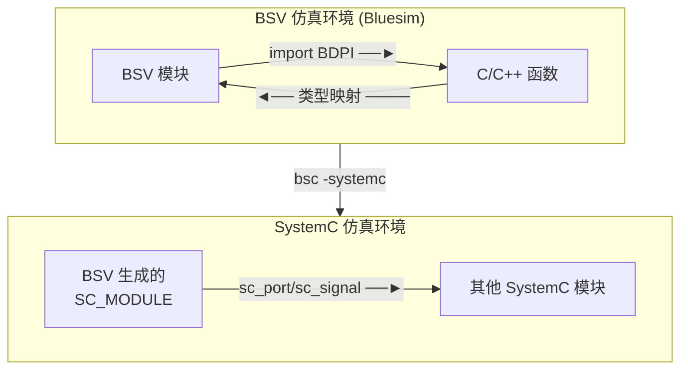

<!--
    <comment> lec 11 interop c / interfacing with c </comment>
--->

# 与 C 互操作

两个方向：

```mermaid
graph TB
    subgraph BSV_Sim ["BSV 仿真环境 (Bluesim)"]
        BSV_Module["BSV 模块"]
        CPP_Func["C/C++ 函数"]
        BSV_Module -- "import BDPI ──►" --> CPP_Func
        CPP_Func -- "◄── 类型映射 ────" --> BSV_Module
    end

    subgraph SystemC_Sim ["SystemC 仿真环境"]
        SC_Module["BSV 生成的<br>SC_MODULE"]
        Other_SC["其他 SystemC 模块"]
        SC_Module -- "sc_port/sc_signal ──►" --> Other_SC
    end

    BSV_Sim -- "bsc -systemc" --> SystemC_Sim
```
